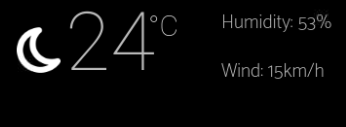

# Wizard Mirror


Wizard Mirror is an open source electron app, that can give a regular mirror mysterious powers with the help of a Raspberry Pi!

# Contents

- [Installation](#installation) 
- [Getting Started](#getting-started)  
	- [Time](#time)
	- [Current Weather](#current-weather)
	- [Weather Forecast](#weather-forecast)
- [Hardware](#hardware)
- [Mirror Software Explanation: How it works](#mirror-software)
- [Contribution](#Contributing)
	- [Improve WizardMirror](#improving-wizardmirror)
	- [Make Apps for WizardMirror](#making-apps)
		- [Positions](#positions)


## Installation

To install WizardMirror: run this on your Raspberry Pi's terminal

`bash -c "$(curl -sL https://raw.githubusercontent.com/Sanjit1/WizardMirror/master/scripts/install.sh)"`

## Getting Started

To start your WizardMirror, run `npm start` from the `WizardMirror` directory. Your WizardMirror can run apps under it, for exapmple a time app or a weather app. App settings can be set in `apps.json` (which is duplicated from [appsSample.json](appsSample.json) by the installation script).

Here are some preinstalled applications:

### Time:
[Time](apps/time) shows the current time on your WizardMirror.
Configuration:
There are there configurations for the time app, which can be changed from `apps.json.apps["time"].config`:

| Setting| Possible Values| Default|  
| :---        |    :----:   |          ---: |
| div | [List of positions](#positions)| pos-topLeft  |
| showSeconds| true/false | false |
| twentyfourhourclock| true/false | false |


### Current Weather:
[Current Weather](apps/weather) shows the weather of a certain location. It updates every 20 minutes.

Configuration:
There are there configurations for the time app, which can be changed from [`apps.json.apps["Current Weather"].config`](appsSample.json#L7):

| Setting| Possible Values| Default|  
| :---        |    :----:   |          ---: |
| div | [List of positions](#positions)| pos-topRight  |
| tempunit| C/F | C |
| speedunit| km/h or m/h | km/h |
| apikey| Free API key from [OpenWeatherMap](https://openweathermap.org/api) | None |
| city| [City List](http://bulk.openweathermap.org/sample/city.list.json.gz) | 5391832 |


### Weather Forecast:
[Weather Forecast](apps/weather) shows the weather of a certain loctaion. It updates every 3 hours
Configuration:
There are there configurations for the time app, which can be changed from [`apps.json.apps"Current Weather".config`](https://github.com/Sanjit1/WizardMirror/blob/165dbe49f85a05bd9519800b06c735226798957f/appsSample.json#L7):

| Setting| Choices | Default|  
| :---        |    :----:   |          ---: |
| div | [List of positions](#positions)| pos-middleRight  |
| unit| C/F | C |
| apikey| 40$ a month API key from [OpenWeatherMap](https://openweathermap.org/api) | None |
| city| [City List](http://bulk.openweathermap.org/sample/city.list.json.gz) | 5391832 |


# Hardware
Once you have finished installing WizardMirror and configured all the software, you can move on to the hardware: the actual mirror design. 
You will need 
- LCD screen
- 2 way mirror glass/film
- Wooden frame to frame the mirror.
- Cables to get your Raspberry Pi running and connect it to the Screen
- Other tools

What you will need to do:
Open up your LCD Screen, attatch the mirror film on top of it, frame it, attatch the Raspberry pi and attatch it to the wall. School's starting, so I cant really do much right now, but as soon as winter break starts I'll try to make a build video.

## Mirror Software:
Here is how it works. WizardMirror uses [Electronjs](https://electronjs.org), as an HTML rendering library. The main script is [`main.js`](main.js), which uses electron to convert main.html into a desktop application. All Application processes occur in [`main.html`](main.html). `main.html` has a script, which attaches scripts and css from apps.json to the document. Electronjs allows you to use node modules in html scripts, so you will not need browserify or any client side-implementation.
Check out how to [contribute](#contributing) to WizardMirror.


# Contributing 

## Improving WizardMirror
You can make pull requests to improove WizardMirror, and If I have not seen your pull request, you can email me, and I'll try to get back asap, usually once my exams are finished ; ) .


## Making Apps
To explain making apps for WizardMirror I'll explain the setup of the time app.
The time app is a simple app, that can be used to explain making apps for WizardMirror. The time app consists of 2 files: [`time.js`](apps/time/time.js) and [`time.css`](apps/time/time.css), which is in the time folder in the apps folder. This is there, so that if `time.js` depends on another file, `foo.js`, and another app like the weather app depends on a file called `foo.js`, there will not be any conflict. `time.js` has only one function: `time()`, which is called at the start of the program. It doe not have any other global functions or variables, so that there is no confusion, with the other js files. For exapmle if there is a variable called unit in time (there is not), and there is another variable called unit in another app, like Weather, there will be a conflict. In the time funciton, there is a function that reads all the config from the [`apps.json`](appsSample.json), and uses it as user settings to produce time information tailored to the users need. Then it uses [DOM](https://developer.mozilla.org/en-US/docs/Web/API/Document_Object_Model/Introduction) to display the time. Make sure while creating a DOM object use class and not id, because otherwise there will be conflicting ID's. While writing javascript for apps, take into consideration that the file will be run from main.html, so all file references should be from [`main.html`](main.html). Just in case some other app has the same class name, make sure to also include the div in which the app functions, so that there is no conflict. For example: use something like `#pos-topLeft  .dateTime{}`. In `main.html` the positions are setup like this
```
<div class="pos-bottomLeft">
<div id="pos-bottomLeft"></div>
</div>
```
The content should be displayed inside the inner div, and the css should also refer to the inner div. 
### Positions
Here is a list of positions, where you can place your apps

