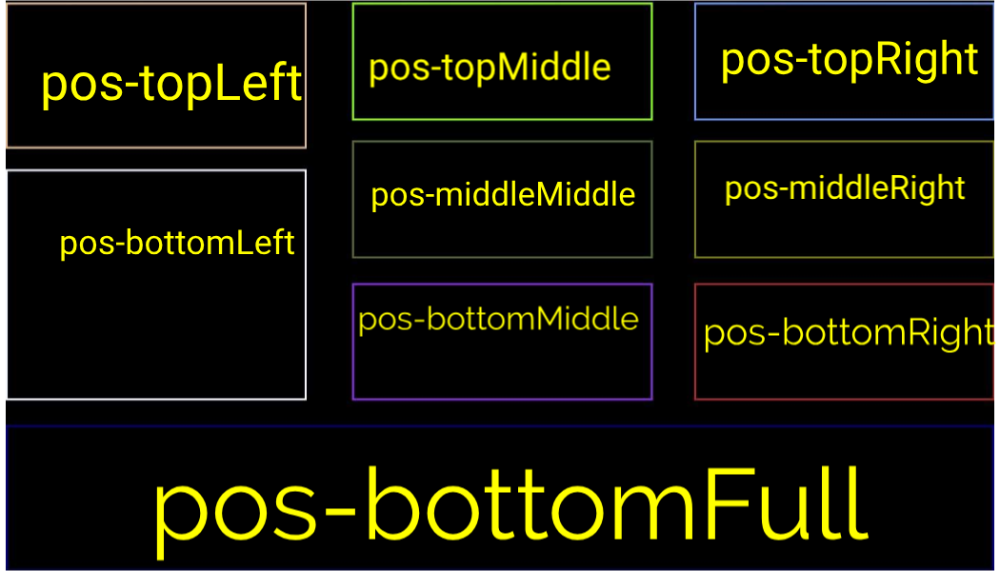

# Wizard Mirror

Wizard Mirror is an open-source [Electronjs](https://electronjs.org) app, that can give a regular mirror mysterious powers with the help of a Raspberry Pi!

# Contents

- [Installation](#installation) 
- [Getting Started](#getting-started)  
	- [Time](#time)
	- [Current Weather](#current-weather)
	- [Weather Forecast](#weather-forecast)
- [Hardware](#hardware)
- [Positions](#positions)
- [Feature Request](#feature-request)

## Installation

To install WizardMirror: run this on your [Raspberry PI's](https://www.raspberrypi.org/) terminal

`bash -c "$(curl -sL https://raw.githubusercontent.com/Sanjit1/WizardMirror/master/scripts/install.sh)"`

## Getting Started

To start your WizardMirror, run `npm start` from the `WizardMirror` directory. Your WizardMirror can run apps under it, for example, a time app or a weather app. App settings can be set in `apps.json` (which is duplicated from [appsSample.json](appsSample.json) by the installation script).

Here are some preinstalled applications:

### Time:
[Time](apps/time) shows the current time on your WizardMirror.

Configuration:

There are configurations for the time app, which can be changed from [`apps.json.apps["time"].config`](appsSample.json#L30):

| Setting| Possible Values| Default| Description |
| :---        |    :----:   |    :----:   |          ---: |
| div | [List of positions](#positions)| pos-topLeft  | The div where time will be displayed|
| showSeconds| true/false | false | To show seconds or not | 
| twentyfourhourclock| true/false | false | 24 Hour clock or not|

 
### Current Weather:
[Current Weather](apps/weather) shows the weather of a certain location. It updates every 20 minutes.

Configuration:

There are configurations for the time app, which can be changed from [`apps.json.apps["Current Weather"].config`](appsSample.json#L7):

| Setting| Possible Values| Default| Description |
| :---        |    :----:   |    :----:   |          ---: |
| div | [List of positions](#positions)| pos-topRight  | The div where time will be displayed|
| tempunit| C/F | C | The unit of temperature to use|
| speedunit| km/h or m/h | km/h | The unit of speed to use | 
| apikey| Free API key from [OpenWeatherMap](https://openweathermap.org/api) | None | The API key to get weather information from [OpenWeatherMap](https://openweathermap.org/api) |
| city| [City List](http://bulk.openweathermap.org/sample/city.list.json.gz) | 5391832 | List of city ID's by [OpenWeatherMap](https://openweathermap.org/api)|

### Weather Forecast:
[Weather Forecast](apps/weather) shows the weather of a certain location. It updates every 3 hours.

Configuration:

There are configurations for the time app, which can be changed from [`apps.json.apps["Weather Forecast"].config`](appsSample.json#L19):

| Setting| Possible Values| Default| Description |
| :---        |    :----:   |    :----:   |          ---: |
| div | [List of positions](#positions)| pos-topRight  | The div where time will be displayed|
| unit| C/F | C | The unit of temperature to use|
| apikey| Free API key from [OpenWeatherMap](https://openweathermap.org/api) | None | The API key to get weather information from [OpenWeatherMap](https://openweathermap.org/api) |
| city| [City List](http://bulk.openweathermap.org/sample/city.list.json.gz) | 5391832 | List of city ID's by [OpenWeatherMap](https://openweathermap.org/api)|

# Hardware
Once you have finished installing WizardMirror and configured all the software, you can move on to the hardware: the actual mirror design. 
You will need 
- LCD screen
- 2-way mirror glass/film
- Wooden frame to frame the mirror.
- Cables to get your Raspberry Pi running and connect it to the Screen
- Other tools

What you will need to do:
Open up your LCD Monitor, attach the mirror film on top of it, frame it, attach the Raspberry pi and attach it to the wall. School's starting, so I can't do much right now, but as soon as winter break starts I'll try to make a build video.

Check out how to [contribute](#contributing) to WizardMirror.

# Positions
Here is a list of positions, where you can place your apps

# Feature Request
You can request features for WizardMirror through its [feathub link](https://feathub.com/Sanjit1/WizardMirror).
Here are requested features, you can vote for them, by clicking on the picture.
 
