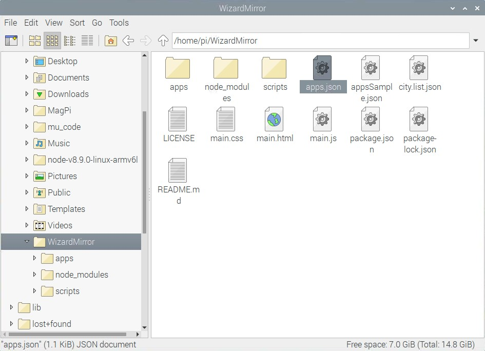
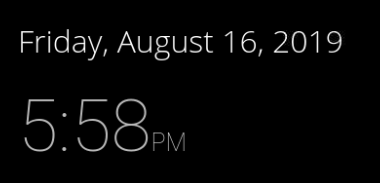

# Wizard Mirror

Wizard Mirror is an open source [Electronjs](https://electronjs.org) app, that can give a regular mirror mysterious powers with the help of a Raspberry Pi!

# Contents

- [Installation](#installation) 
- [Getting Started](#getting-started)  
	- [Time](#time)
	- [Current Weather](#current-weather)
	- [Weather Forecast](#weather-forecast)
- [Hardware](#hardware)
- [Mirror Software Explanation: How it works](#mirror-software)
- [Contribution](#Contributing)
	- [Improve WizardMirror](#improving-wizardmirror)
	- [Make Apps for WizardMirror](#making-apps)
		- [Positions](#positions)

## Installation

To install WizardMirror: run this on your [Raspberry PI's](https://www.raspberrypi.org/) terminal

`bash -c "$(curl -sL https://raw.githubusercontent.com/Sanjit1/WizardMirror/master/scripts/install.sh)"`

## Getting Started

To start your WizardMirror, run `npm start` from the `WizardMirror` directory. Your WizardMirror can run apps under it, for example a time app or a weather app. App settings can be set in `apps.json` (which is duplicated from [appsSample.json](appsSample.json) by the installation script).

Here are some preinstalled applications:

### Time:
[Time](apps/time) shows the current time on your WizardMirror.

Configuration:

There are configurations for the time app, which can be changed from [`apps.json.apps["time"].config`](appsSample.json#L30):

| Setting| Possible Values| Default| Description |
| :---        |    :----:   |    :----:   |          ---: |
| div | [List of positions](#positions)| pos-topLeft  | The div where time will be displayed|
| showSeconds| true/false | false | To show seconds or not | 
| twentyfourhourclock| true/false | false | 24 Hour clock or not|

 
### Current Weather:
[Current Weather](apps/weather) shows the weather of a certain location. It updates every 20 minutes.

Configuration:

There are configurations for the time app, which can be changed from [`apps.json.apps["Current Weather"].config`](appsSample.json#L7):

| Setting| Possible Values| Default| Description |
| :---        |    :----:   |    :----:   |          ---: |
| div | [List of positions](#positions)| pos-topRight  | The div where time will be displayed|
| tempunit| C/F | C | The unit of temperature to use|
| speedunit| km/h or m/h | km/h | The unit of speed to use | 
| apikey| Free API key from [OpenWeatherMap](https://openweathermap.org/api) | None | The API key to get weather information from [OpenWeatherMap](https://openweathermap.org/api) |
| city| [City List](http://bulk.openweathermap.org/sample/city.list.json.gz) | 5391832 | List of city ID's by [OpenWeatherMap](https://openweathermap.org/api)|

### Weather Forecast:
[Weather Forecast](apps/weather) shows the weather of a certain loctaion. It updates every 3 hours.

Configuration:

There are configurations for the time app, which can be changed from [`apps.json.apps["Weather Forecast"].config`](appsSample.json#L19):

| Setting| Possible Values| Default| Description |
| :---        |    :----:   |    :----:   |          ---: |
| div | [List of positions](#positions)| pos-topRight  | The div where time will be displayed|
| unit| C/F | C | The unit of temperature to use|
| apikey| Free API key from [OpenWeatherMap](https://openweathermap.org/api) | None | The API key to get weather information from [OpenWeatherMap](https://openweathermap.org/api) |
| city| [City List](http://bulk.openweathermap.org/sample/city.list.json.gz) | 5391832 | List of city ID's by [OpenWeatherMap](https://openweathermap.org/api)|

# Hardware
Once you have finished installing WizardMirror and configured all the software, you can move on to the hardware: the actual mirror design. 
You will need 
- LCD screen
- 2 way mirror glass/film
- Wooden frame to frame the mirror.
- Cables to get your Raspberry Pi running and connect it to the Screen
- Other tools

What you will need to do:
Open up your LCD Monitor, attatch the mirror film on top of it, frame it, attatch the Raspberry pi and attatch it to the wall. School's starting, so I cant really do much right now, but as soon as winter break starts I'll try to make a build video.

## Mirror Software:
WizardMirror uses [Electronjs](https://electronjs.org), as an HTML rendering library. The main script is [`main.js`](main.js), which uses [Electronjs](https://electronjs.org) to convert main.html into a desktop application. [`main.html`](main.html) uses a [black background](main.css#L2), and displays in [white text](main.css#L3), to give it the mirror effect, while still displaying text. All Application processes occur in [`main.html`](main.html). [`main.html`](main.html) has a [script](main.html#L47), which attaches scripts and css from apps.json to the document. Electronjs allows you to use node modules in html scripts, so you will not need browserify or any client side-implementation.
Check out how to [contribute](#contributing) to WizardMirror.

# Contributing 

## Improving WizardMirror
You can make pull requests to improve WizardMirror. While improving WizardMirror make sure that if you change any file like [`main.js`](main.js) or [`main.html`](main.html), which have line numbers cited in this readme then make sure to also include those changes in the readme and if you need help doing so, then tell me so in the pull request. If I have not seen your pull request, you can email me, and I'll try to get back asap, usually once my exams are finished ; ) . 

# Making Apps
The time app is a great example for making apps. WizardMirror has some guidelines for App development, and some example links to the time app, for clarifiction:
- Only [one funciton](apps/time/time.js#L2) should be used in a script, which should be [called at the begining](apps/time/time.js#L1) of the script. 
- All other functions and variables should be [enclosed inside the funciton](apps/time/time.js#L14)
- The apps should [read for config or user settings](apps/time/time.js#L4) from [apps.json](appsSample.json#L27).
- If your app displays content on the screen then you should have a [div option](appsSample.json#L31) in the apps.json, which allows users to easily manage where they place their apps.
- Each [DOM](https://developer.mozilla.org/en-US/docs/Web/API/Document_Object_Model/Introduction) element should have a [className](apps/time/time.js#L25), so that you can write CSS for it, but no ids, otherwise there may be conflicting ID's.
- Since other apps may have [DOM](https://developer.mozilla.org/en-US/docs/Web/API/Document_Object_Model/Introduction) elements with the same class names, while writing CSS, make sure that you do not just use class names or element tags. Use a [combination of the div position ID and the class name](apps/time/time.css#L1) to define CSS. Here is a list of [positions](#positions) on your WizardMirror.

The javascript file of the app that will be defined in the [apps.json](appsSample.json#L28) is injected in [`main.html`](mian.html) by this [script](mian.html#L47). So you can write js for WizardMirror similar to the way you would write js for an HTML document. The only difference is since electron is rendering the js, you can use your favourite [node](https://nodejs.org/en/about/) modules. This setting is defined [here](main.js#L16). I'll create a page soon where all 3rd party apps can be 
displayed.
### Positions
Here is a list of positions, where you can place your apps

